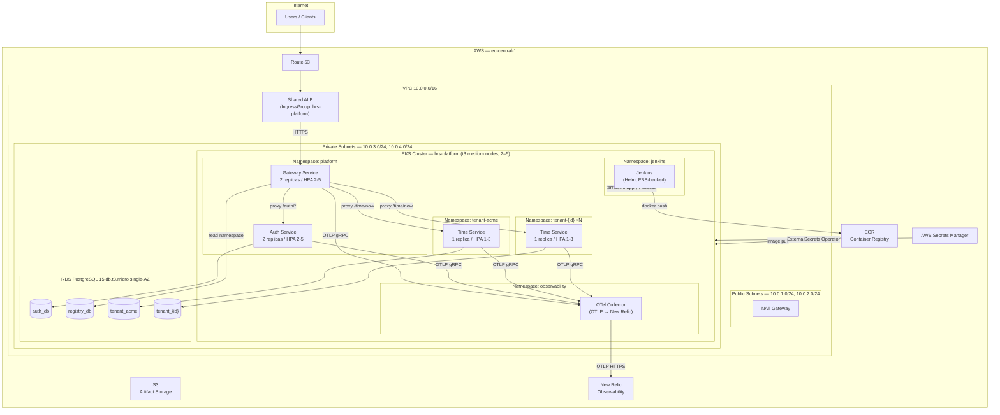
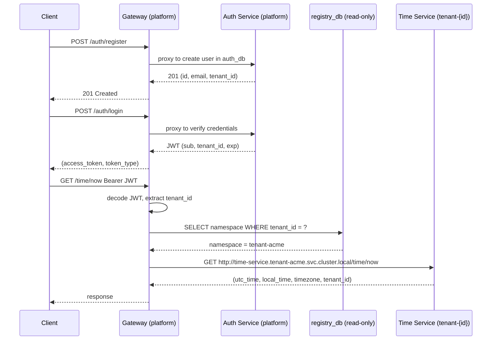
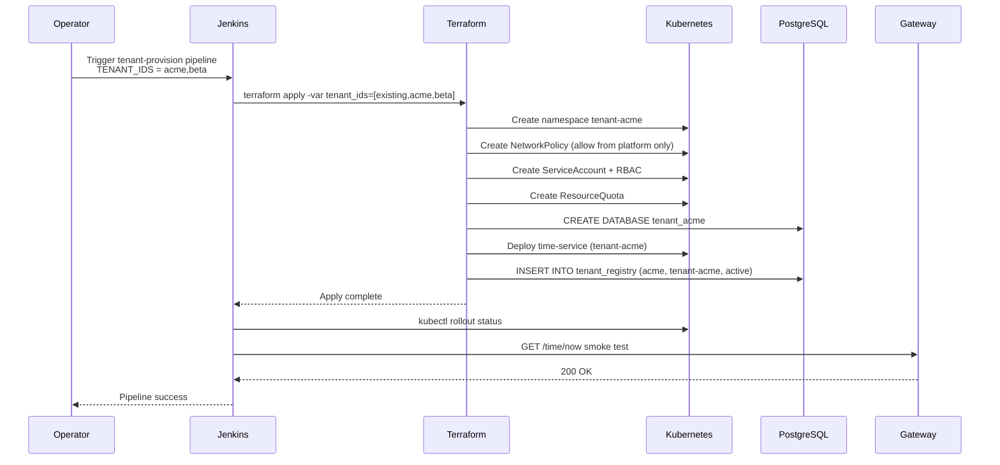

# Platform Design — HRS Group Multi-Tenant Application Platform

## Architecture Overview

The HRS Platform is a multi-tenant application platform built on AWS EKS, supporting 20+ engineering
teams (250+ engineers) with a clear path to 50+ teams. Each tenant is isolated at the Kubernetes
namespace level with network policies, dedicated databases, and RBAC.

---

## High-Level Architecture



---

## Request Flow



---

## Tenant Provisioning Flow



---

## Multi-Tenancy Isolation Strategy

### Namespace-per-Tenant Model

Each tenant gets a dedicated Kubernetes namespace (`tenant-{id}`), providing layered isolation:

| Layer | Mechanism | Detail |
|---|---|---|
| **Network** | `NetworkPolicy` | Default-deny-all; allow ingress only from `platform` namespace on port 8080 |
| **RBAC** | Per-namespace `ServiceAccount` | No cross-namespace permissions; Jenkins SA scoped to provision only |
| **Resource limits** | `ResourceQuota` | 2 CPU / 2Gi RAM per tenant namespace (configurable) |
| **Database** | Dedicated PostgreSQL DB | `tenant_{id}` DB on shared RDS; no cross-tenant SQL access |
| **Service discovery** | K8s DNS | `time-service.tenant-{id}.svc.cluster.local` — unreachable from peer namespaces |
| **Compute** | Shared node pool | Pods co-scheduled on nodes; node-level isolation via Fargate in Phase 2 |
| **Secrets** | ESO + Secrets Manager | Per-service K8s Secrets — no shared secret objects across namespaces |

### Registry DB — Read-Only for Gateway

The `registry_db.tenant_registry` table is the **phonebook** for the gateway:

```sql
CREATE TABLE tenant_registry (
    tenant_id    VARCHAR PRIMARY KEY,
    namespace    VARCHAR NOT NULL,        -- "tenant-{id}"
    service_name VARCHAR DEFAULT 'time-service',
    status       VARCHAR DEFAULT 'active',
    created_at   TIMESTAMP DEFAULT NOW()
);
```

- **Writer**: Terraform tenant module only (during provisioning)
- **Reader**: Gateway service on every `/time/now` request to resolve the target namespace
- The gateway **never writes** to this table; the table reflects provisioned infrastructure state

---

## Scalability: 20 → 50+ Teams

### Horizontal Scaling Path

| Component | 20 teams | 50 teams | Mechanism |
|---|---|---|---|
| EKS nodes | 2–4 × t3.medium | 5–10 × t3.medium | Cluster Autoscaler |
| Gateway replicas | 2 | 4–6 | HPA (target CPU 60%) |
| Auth replicas | 2 | 4–6 | HPA (target CPU 60%) |
| Time Service per tenant | 1 | 1–3 | HPA per namespace |
| RDS instance type | db.t3.micro | db.t3.small | Manual resize (~15 min) |
| RDS connections | 34 (t3.micro) | 86 (t3.small) | PgBouncer at 50+ tenants |

### Namespace Scaling

50 tenants = 50 namespaces. EKS default limit is 10,000 namespaces — no constraint.
Each tenant namespace adds ~1 Deployment, 1 Service, 1 NetworkPolicy, 1 ResourceQuota.

### Bottlenecks & Mitigations

| Bottleneck | Threshold | Mitigation |
|---|---|---|
| RDS max connections (db.t3.micro: 34) | ~20 tenants | Upgrade to db.t3.small (86 conn) or add PgBouncer |
| Registry DB query per request | High RPS | Add Redis cache (TTL 60s) in Gateway Phase 2 |
| Single NAT Gateway | High egress | Add second NAT at 100+ tenants for HA |
| Shared node CPU/memory | ~40+ concurrent tenants | Add dedicated node group for tenant workloads |

---

## Cost Estimate — AWS eu-central-1

> Pricing as of Q1 2026. All figures in USD/month.

### Baseline: 20 Teams (~60 running pods)

| Service | Specification | Unit Cost | Monthly |
|---|---|---|---|
| EKS Control Plane | 1 cluster | $0.10/hr | **$73** |
| EC2 On-Demand | 2 × t3.medium | $0.0416/hr each | **$61** |
| EC2 Spot (~70% of extra) | 3 × t3.medium avg | ~$0.013/hr each | **$28** |
| RDS PostgreSQL 15 | db.t3.micro, 20GB gp3, single-AZ | $0.021/hr + $2.30 storage | **$18** |
| NAT Gateway | 1× + 50GB/mo data | $0.045/hr + $0.045/GB | **$36** |
| ALB (shared) | ~15 LCUs avg | $0.008/hr + $0.008/LCU/hr | **$15** |
| S3 | 10GB + standard requests | $0.023/GB | **$1** |
| ECR | 3 repos, ~3GB | $0.10/GB over 500MB free | **$0.30** |
| Route 53 | 1 hosted zone | flat | **$0.50** |
| ACM | TLS certificate | Free | **$0** |
| **Total (infra only)** | | | **~$233/mo** |

### At 50 Teams

| Change | Delta |
|---|---|
| +3 EKS nodes Spot t3.medium | +$28 |
| RDS upgrade db.t3.micro → db.t3.small | +$18 |
| Additional data transfer (~100GB) | +$10 |
| **Total at 50 teams** | **~$289/mo** |

> **New Relic**: Pricing is contract-based (Standard ~$49/user/mo or data ingest model at $0.30/GB
> over 100GB free/mo). Not included above — treated as a separate line item.

### Cost Optimizations Applied

- **Single NAT Gateway** (vs. 2 for HA): saves ~$33/mo
- **Single-AZ RDS** (vs. Multi-AZ): saves ~$15/mo — mitigated by automated daily backups
- **Spot instances** (70% of non-guaranteed nodes): saves ~$40/mo vs. all On-Demand
- **Shared ALB** via `alb.ingress.kubernetes.io/group.name` annotation: saves ~$14/ALB/mo
- **Shared RDS instance** (multiple databases, not multiple instances): saves ~$15/tenant/mo
- **Jenkins on EKS** (not a separate EC2): no additional instance cost

---

## Key Design Trade-offs

| Decision | Chosen | Alternative | Rationale |
|---|---|---|---|
| **Tenant isolation** | Namespace-per-tenant | Cluster-per-tenant | Cost: separate clusters = $73/mo × N; namespace provides sufficient isolation at this scale |
| **Compute** | Shared node pool (t3.medium) | EKS Fargate | Fargate is 2–3× more expensive per vCPU/GB for sustained workloads |
| **Database** | Shared RDS, per-tenant DB | Separate RDS per tenant | Saves ~$15/tenant/mo; PostgreSQL GRANT-based isolation enforced at DB level |
| **NAT HA** | 1 NAT Gateway | 2 NAT Gateways | Saves $33/mo; acceptable single-AZ NAT failure risk with retry logic in services |
| **RDS HA** | Single-AZ | Multi-AZ | Saves $15/mo; daily automated backups + PITR enable <30 min RTO |
| **Secrets** | AWS Secrets Manager + ESO | HashiCorp Vault | No separate Vault cluster to operate; ESO is trivial to run; Secrets Manager ~free at this scale |
| **Ingress** | AWS ALB (LBC) | nginx-ingress | Native AWS integration; no extra DaemonSet on every node |
| **Service mesh** | None (Phase 1) | Istio / Linkerd | Adds ~300MB RAM overhead per node; mTLS + advanced observability deferred to Phase 2 |
| **Auth DB** | PostgreSQL via `DATABASE_URL` env | SQLite (original) | SQLite unsupported for multi-replica stateless pods; env-var override is minimal code change |
| **DB migrations** | Auto-create on startup (`metadata.create_all`) | Alembic migrations | Time-constrained; **Alembic is the correct production approach** and should be introduced before adding schema changes |

---

## Disaster Recovery

| Component | RPO | RTO | Strategy |
|---|---|---|---|
| EKS cluster | N/A (stateless control plane) | 20 min | Re-provision via `terraform apply` |
| Application pods | N/A (stateless) | 5 min | Kubernetes self-heals; ECR images immutable-tagged |
| RDS databases | 5 min | 30 min | Automated backups (7-day retention), point-in-time restore |
| Terraform state | N/A | 5 min | Stored on Jenkins EBS PVC; recommend S3 backend for production |
| Secrets | N/A | Immediate | AWS Secrets Manager is multi-AZ by default |

> **Production recommendation**: Upgrade RDS to Multi-AZ (automatic failover ~1 min) and add a
> cross-region read replica for DR. Estimated additional cost: +$15–30/mo.

---

## Security Best Practices

1. **IRSA (IAM Roles for Service Accounts)**: Each K8s ServiceAccount maps to a minimal IAM role via OIDC — no long-lived AWS credentials in pods
2. **No secrets in manifests**: All sensitive values sourced from AWS Secrets Manager via ExternalSecrets Operator → K8s Secrets
3. **TLS everywhere**: ALB terminates TLS with ACM certificate; internal service-to-service over HTTP inside the cluster VPC (service mesh mTLS in Phase 2)
4. **Network policies**: Default-deny-all per tenant namespace; explicit allow-from-platform ingress only
5. **RBAC least privilege**: ServiceAccounts scoped to their own namespace; Jenkins SA restricted to provisioning operations only
6. **Container security**: Non-root user in Dockerfiles (Phase 2); read-only root filesystem where possible
7. **Image signing**: ECR image scanning enabled; immutable tags prevent tag mutation attacks
8. **Audit logging**: EKS CloudTrail audit logs enabled; all AWS API calls logged
