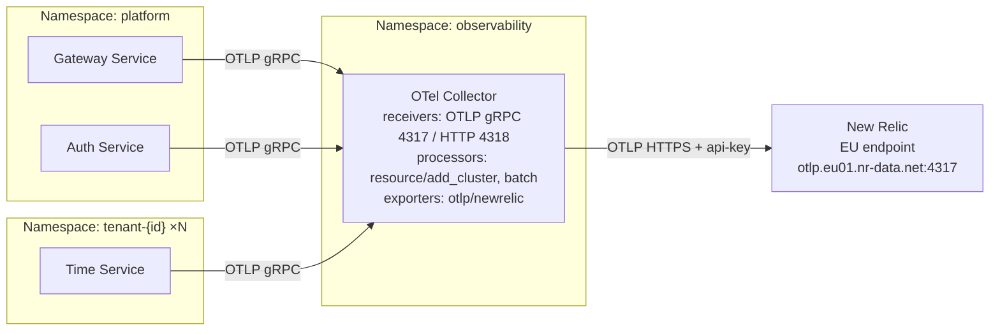

# Observability — HRS Platform

## Strategy Overview

The HRS Platform uses **OpenTelemetry** as the vendor-neutral collection layer and **New Relic** as
the observability backend. All three signal types (traces, metrics, logs) flow through a central
OTel Collector deployed in the `observability` namespace, which enriches telemetry with
cluster-level attributes before forwarding to New Relic via OTLP over HTTPS.

---

## Architecture



---

## Instrumentation

Each service uses the **OpenTelemetry Python SDK** with `FastAPIInstrumentor` for automatic span
generation. Services emit:

| Signal | Source | Key Attributes |
|---|---|---|
| **Traces** | FastAPIInstrumentor + manual spans | `tenant_id`, `request_id`, `http.method`, `http.route`, `http.status_code` |
| **Metrics** | OTLP metrics (via SDK) | `service.name`, `tenant_id`, `http.route` |
| **Logs** | Structured JSON logs → OTLP log exporter | `tenant_id`, `trace_id`, `span_id`, `request_id`, `event` |

**Tenant isolation in telemetry**: Every span/metric/log from the `time-service` carries
`tenant_id` in its resource attributes (set via `TENANT_ID` env var and OTEL resource). This
enables per-tenant filtering in New Relic dashboards.

### Collector Enrichment

The `resource/add_cluster` processor inserts two attributes on all telemetry before export:
- `service.cluster = hrs-platform`
- `deployment.environment = production`

This allows global filtering in New Relic across all tenants and services.

---

## Service Level Indicators (SLIs) and Objectives (SLOs)

| Service | SLI | SLO |
|---|---|---|
| Gateway | Request latency p99 | < 200ms |
| Gateway | Error rate (5xx) | < 0.1% over 5-min window |
| Auth Service | Login latency p99 | < 300ms |
| Auth Service | Registration success rate | > 99.9% |
| Time Service (per tenant) | Response latency p99 | < 150ms |
| Time Service (per tenant) | Availability | > 99.5% |

### SLO Alerting Thresholds

| Alert | Condition | Severity |
|---|---|---|
| Gateway high error rate | 5xx > 1% over 2 min | Critical |
| Time service down | No successful requests for 60s | Critical |
| Gateway latency degraded | p95 > 500ms over 5 min | Warning |
| Pod crash looping | Restart count > 3 in 10 min | Warning |

---

## Key New Relic Dashboards

### 1. Platform Health Overview
- Total request rate across all services (faceted by `service.name`)
- Error rate over time (faceted by `service.name`, `http.status_code`)
- p50 / p95 / p99 latency per service
- EKS node CPU and memory utilisation

### 2. Tenant Activity
- Requests per tenant (`tenant_id` attribute) — time series
- Error count per tenant — ranked list
- Time service latency per tenant — heatmap
- Active tenant count (unique `tenant_id` values in last 1h)

### 3. Auth Service
- Registration rate vs login rate
- Failed login attempts (potential abuse indicator)
- JWT decode errors

### 4. Infrastructure
- EKS pod count by namespace
- RDS connection count, CPU utilisation, IOPS
- NAT Gateway bytes out (data transfer cost indicator)

---

## New Relic NRQL Query Examples

```sql
-- Request rate by service
SELECT rate(count(*), 1 minute) FROM Span
WHERE service.cluster = 'hrs-platform'
FACET service.name TIMESERIES

-- p99 latency by tenant (time-service)
SELECT percentile(duration.ms, 99) FROM Span
WHERE service.name = 'time-service'
FACET tenant_id TIMESERIES

-- Error rate per service (last 30 min)
SELECT percentage(count(*), WHERE http.response.statusCode >= 500)
FROM Span
WHERE service.cluster = 'hrs-platform'
FACET service.name SINCE 30 minutes ago

-- Tenant isolation check — no cross-tenant spans
SELECT count(*) FROM Span
WHERE service.name = 'time-service'
  AND tenant_id IS NOT NULL
FACET tenant_id
```

---

## Environment Variables

| Variable | Description |
|---|---|
| `NEW_RELIC_LICENSE_KEY` | New Relic ingest license key (injected from K8s Secret) |
| `ENVIRONMENT` | Deployment environment label (e.g. `production`) |
| `OTEL_EXPORTER_OTLP_ENDPOINT` | OTel Collector endpoint (set to `http://otel-collector.observability.svc.cluster.local:4317`) |

---

## Future Work

- **New Relic Service Levels**: Define SLO tracking directly in New Relic using the Service Levels UI
- **Alerting policies**: Configure alert conditions in New Relic for all SLO breaches, routed to PagerDuty
- **Span sampling**: Add probabilistic tail sampling in the collector for high-traffic tenants
- **Per-tenant New Relic sub-accounts**: When tenant count exceeds 50, isolate tenant telemetry into separate sub-accounts for billing and access control
